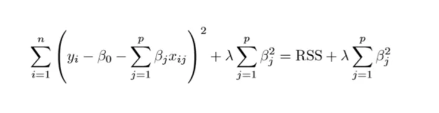

# Regularization
This is a form of regression, that constrains/ **regularizes** or shrinks the coefficient estimates towards zero. In other words, this technique **discourages learning a more complex or flexible model**, so as to avoid the risk of **overfitting**.

## Ridge Regression

The RSS is modified by adding the shrinkage quantity.
$\lambda$ is the tuning parameter that decides how much we want to penalize thr flexibility of our model. The increase in flexibility of a model is represented by increase in its coefficients. If we want to minimize the above function, then these coefficients need to be small. This is how the Ridge regression technique prevents coefficients from rising too high. **Selecting a good value of λ is critical.** **Cross validation** comes in handy for this purpose. The coefficient estimates produced by this method are also known as the **L2 norm.**
**We need to standardize the predictors or bring the predictors to the same scale before performing ridge regression.**

## Lasso Regression

 It uses $|β_j|$(modulus)instead of squares of $β$, as its penalty. In statistics, this is known as the L1 norm.

 
This sheds light on the obvious disadvantage of ridge regression, which is model interpretability. It will shrink the coefficients for least important predictors, very close to zero. But it will never make them exactly zero. In other words, the final model will include all predictors. However, in the case of the lasso, the L1 penalty has the effect of forcing some of the coefficient estimates to be exactly equal to zero when the tuning parameter λ is sufficiently large. Therefore, **the lasso method also performs variable selection and is said to yield sparse models.**

## Why Regularization?
**Regularization, significantly reduces the variance of the model, without substantial increase in its bias.** So the tuning parameter λ, used in the regularization techniques described above, controls the impact on bias and variance. As the value of λ rises, it reduces the value of coefficients and thus reducing the variance. Till a point, this increase in λ is beneficial as it is only reducing the variance(hence **avoiding overfitting**), without loosing any important properties in the data. But after certain value, the model starts loosing important properties, giving rise to bias in the model and thus **underfitting**. **Therefore, the value of λ should be carefully selected.**